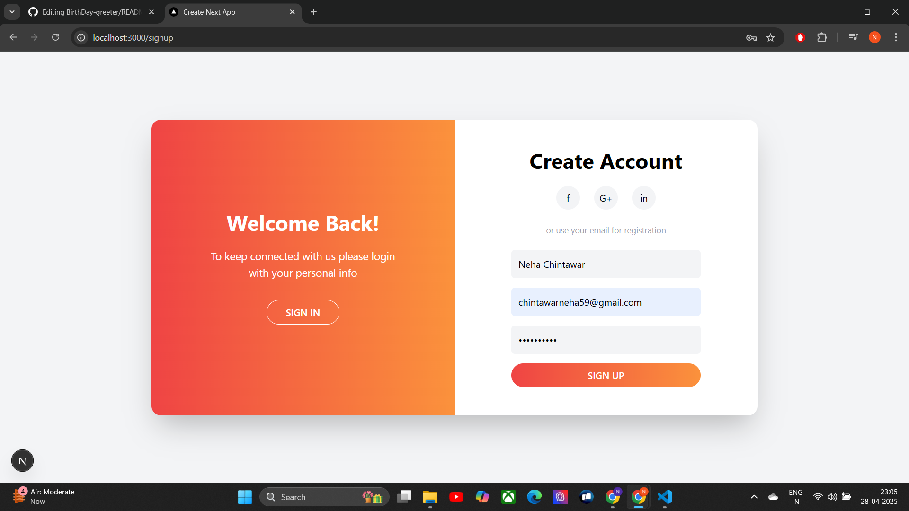
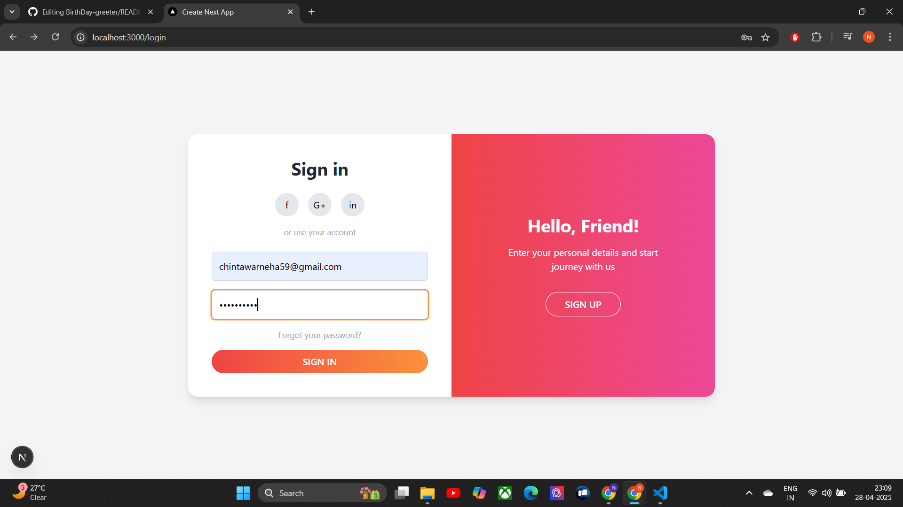
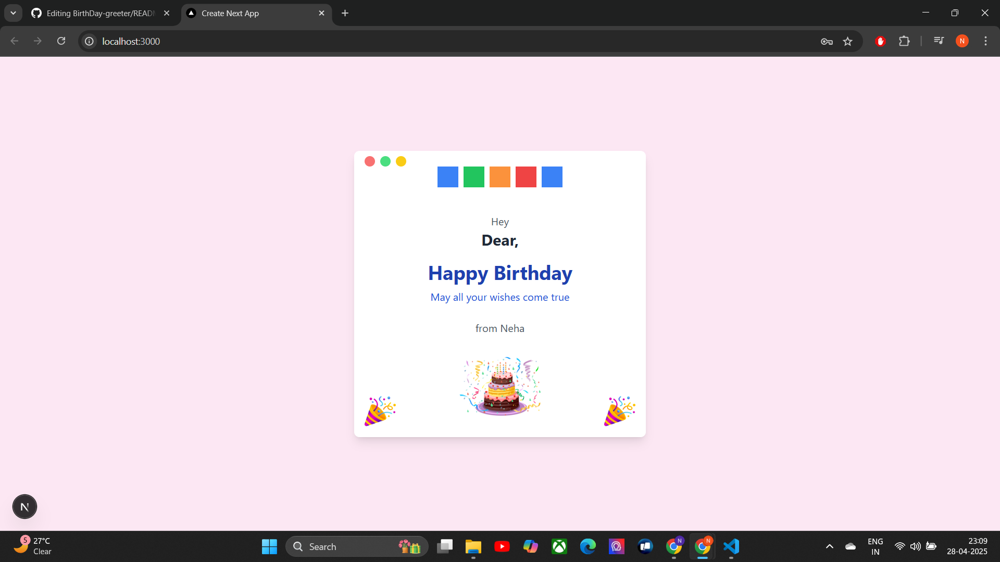

#BirthDay-Greeter

A simple Sign In / Sign Up app built with Next.js. After logging in, a birthday wishes popup is shown to the user.

hashtag#Features

-Sign In and Sign Up (mocked using localStorage)

-Popup with birthday wishes

-Styled with Tailwind CSS

-Client-side only (no real backend)

hashtag#Installation

git clone (https://github.com/nehachintawar/BirthDay-greeter.git)

cd BirthDay-Greeter

npm install

npm run dev

Visit https://localhost:3000

hashtag#How It Works

-On the homepage, the user signs in with an email and password.

-If the user does not have an account, they can sign up on the Sign Up page.

-After signing in, a Birthday Wishes Popup appears to greet the user.

hashtag#ScreenShots

-Sign Up

-Sign In

-BdayCard

hashtag#Github Repo - https://github.com/nehachintawar/BirthDay-greeter